# Building an Internet Research Assistant with OpenAI Swarm

Recently, OpenAI released **Swarm** – an open-source framework designed to manage and coordinate multiple AI agents in a highly customizable way.

### What Are AI Agents?
AI Agents are autonomous systems capable of reasoning, thinking, planning, identifying relevant sources, extracting information, taking actions, and self-correcting when needed.

---

### A Hands-On Demo: Internet Research Assistant App

Today, let's explore a practical demo by building an internet research assistant app that:

1. **Accepts a user query**
2. **Searches the web for relevant information**
3. **Generates a well-crafted article**

---

### Tech Stack
- **OpenAI Swarm** for multi-agent orchestration
- **Streamlit** for the UI

---

### Step-by-Step Workflow of the Multi-Agent App

In this demo, our multi-agent app comprises three agents:

1. **Agent 1** → Receives the user query and performs a web search.
2. **Agent 2** → Processes and refines the search results from Agent 1.
3. **Agent 3** → A technical writing agent that uses the refined information to draft an article, returning it to the user.

---

This setup highlights the power of using multiple agents in a coordinated system for creating complex applications.

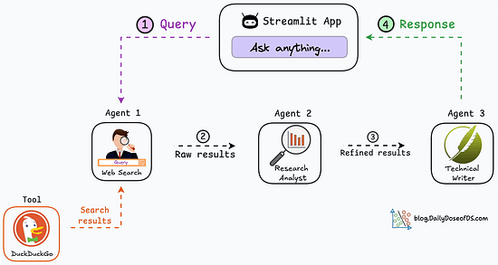
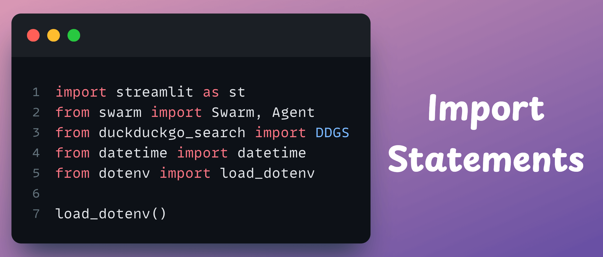
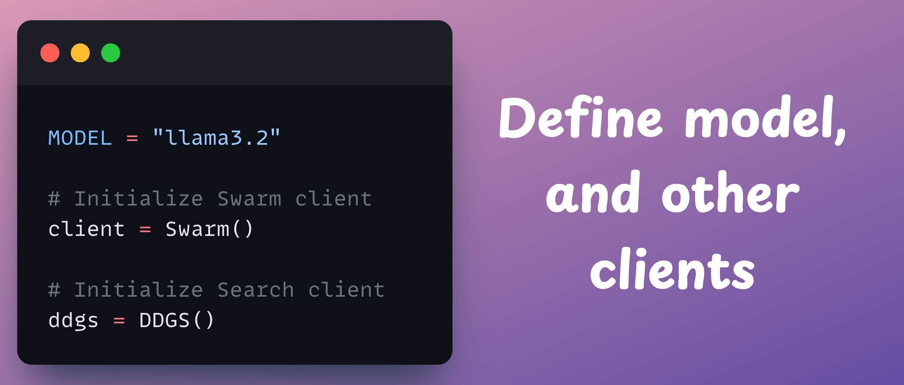
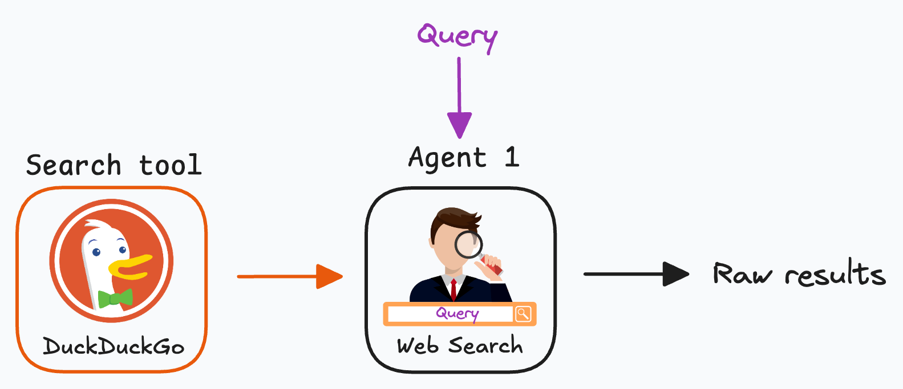
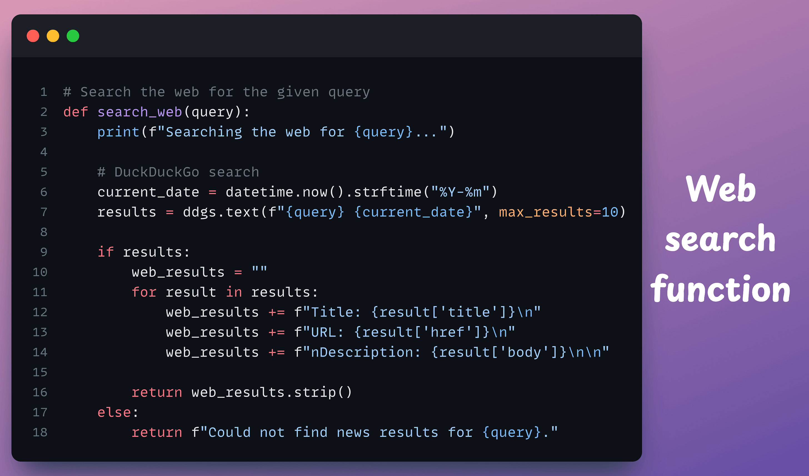
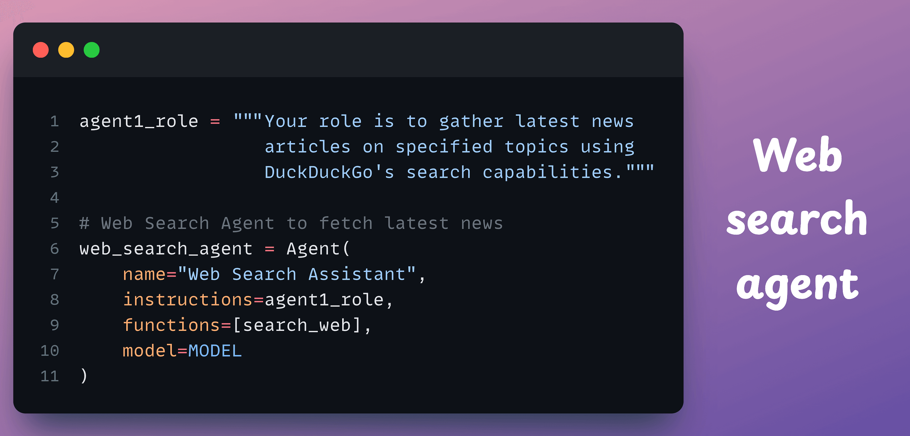
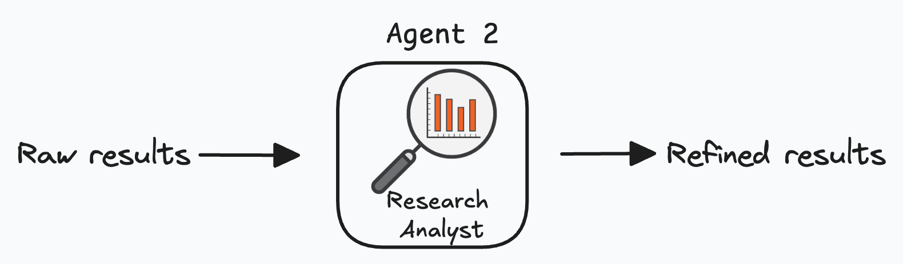
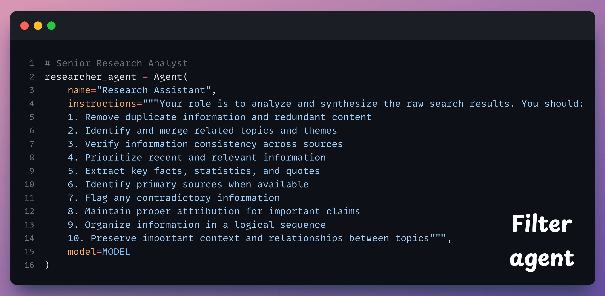
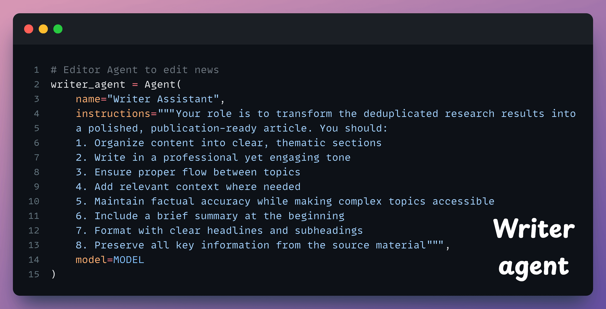
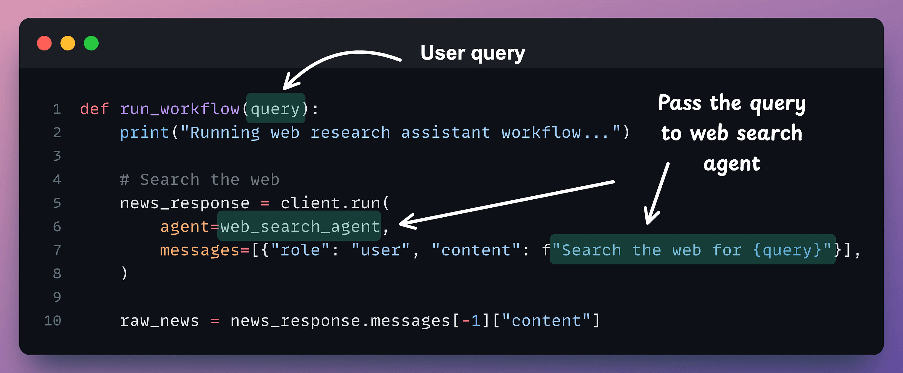
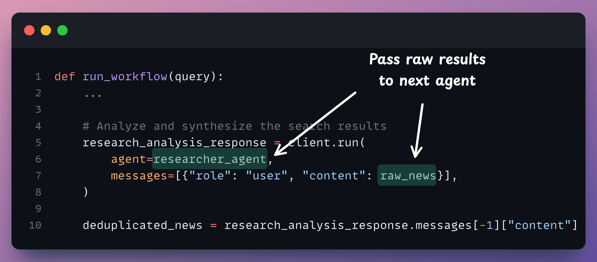
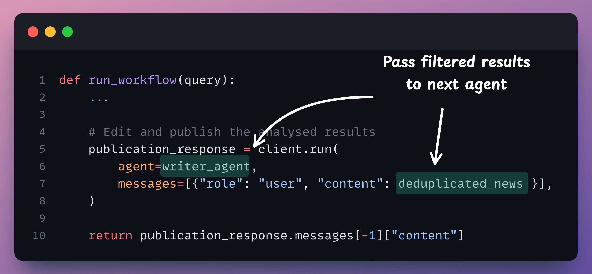

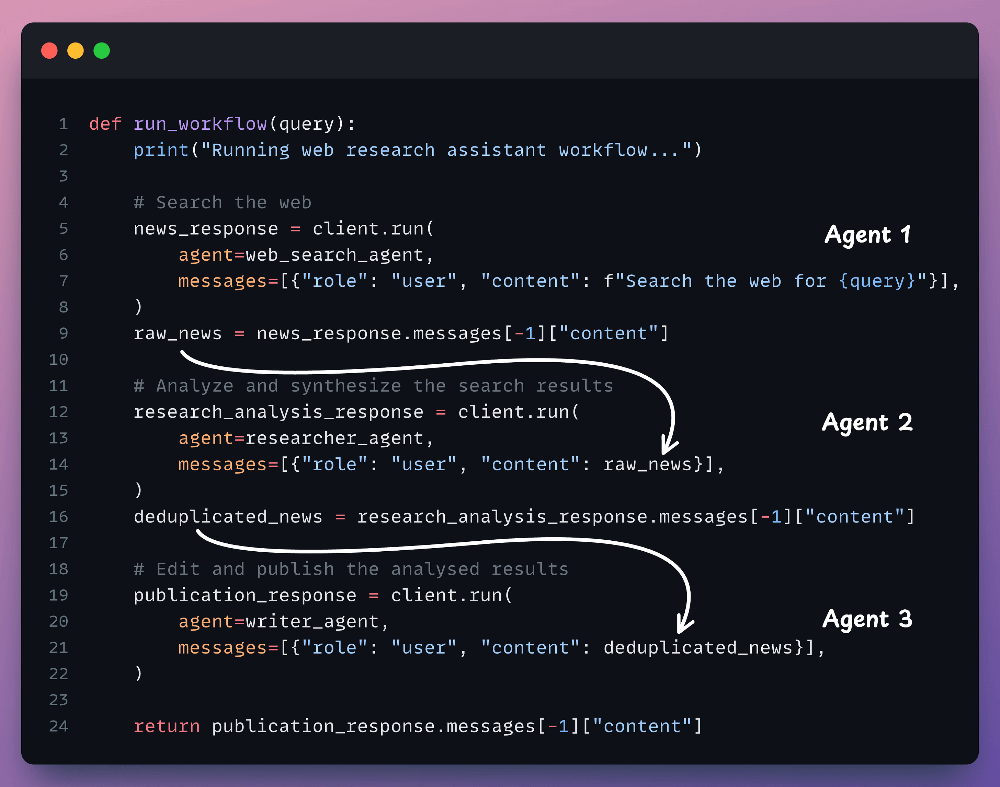
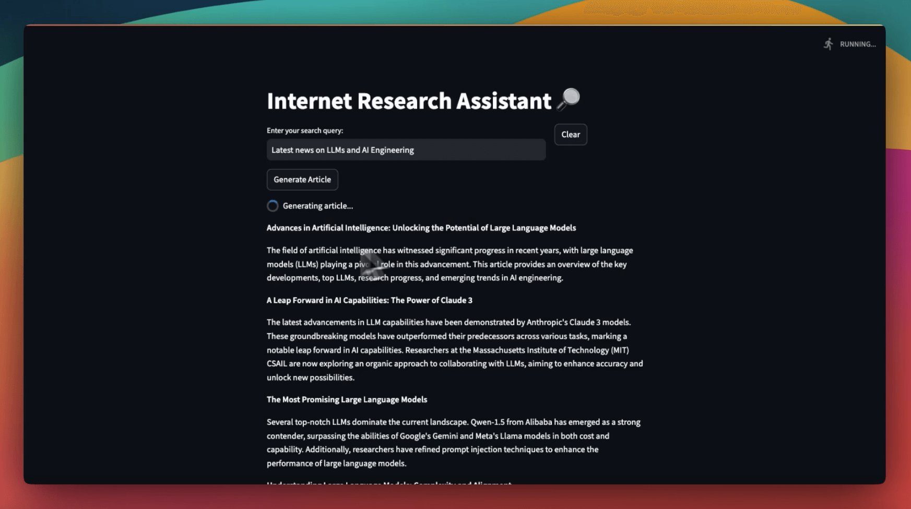
